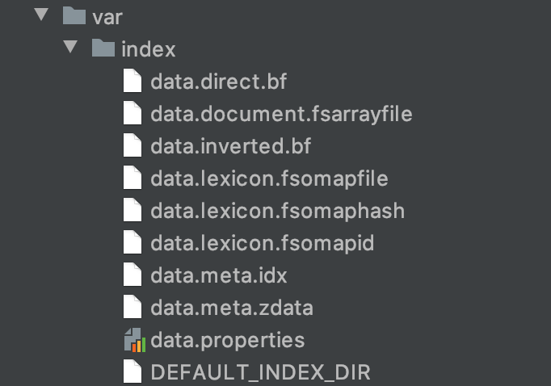

# 现代信息检索大作业
## 环境
开发环境：Mac OS
软件版本：Java JRE 1.8.0、Python 3.7、Terrier5.0

## 数据预处理成.xml格式

cd modules/xml 下，执行脚本：

```zsh
python3 clinicaltrials_xml.py
```
## 对预处理后的.xml文件执行去停用词和词形还原

cd modules/xml 下，执行脚本：

```zsh
python3 process.py
```

## 病例Age和topic的Age处理+topic提出主要字段
cd modules/xml 下，执行脚本：
```zsh
python3 clinicaltrials_age.py
python3 topics2018_XmlAndAge.py
```
处理后病例、topic的Age和topic主要字段文件存放在：
```zsh
collection_pre/clinicaltrials_AgeInfo.csv
collection_pre/topics2018_Age.csv
collection_pre/topics2018.xml
```

## 收集数据文档并建立索引
### 收集数据文档
```zsh
bin/trec_setup.sh collection_pre1
```

### 建立索引
```zsh
bin/terrier batchindexing
```
索引目录如下：

### 查看索引信息
```zsh
bin/terrier indexstats
```
